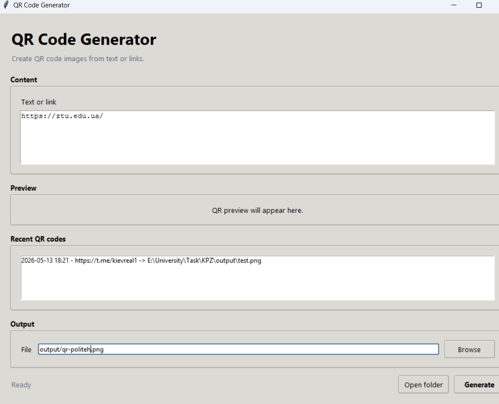
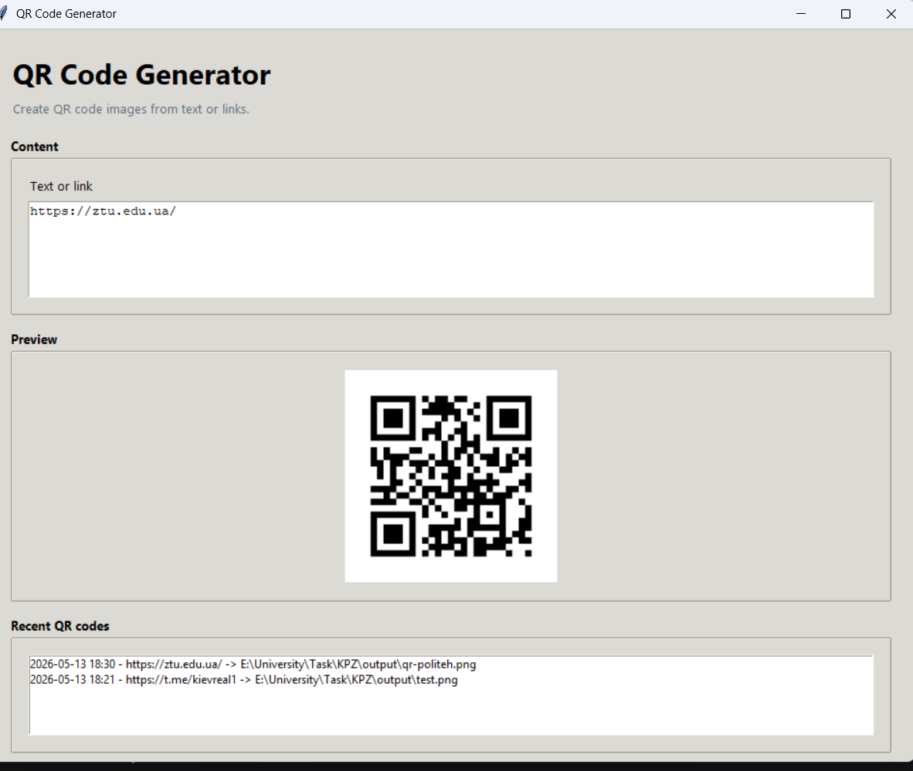

# QR Code Generator

QR Code Generator is a Python application for creating QR codes from text or links.
The project contains both a command-line interface and a graphical desktop interface built with `tkinter`.

## Project Goal

The goal of the project is to demonstrate a complete small Python application with:

- QR code generation;
- PNG file saving;
- a desktop GUI;
- generation history;
- configurable QR style options;
- automated tests;
- clear Git history with feature commits, a separate branch, and a merge commit.

Project topic: **QR code generator with GUI, file saving, style settings, preview, and generation history**.

## Features

- generate QR codes from the command line;
- generate QR codes from a graphical interface;
- save generated QR codes as PNG files;
- choose the output folder and filename;
- customize QR box size and border;
- customize foreground and background colors;
- preview the generated QR code in the GUI;
- store the latest generated QR codes in `output/history.json`;
- open the output folder from the GUI;
- generate many QR codes from `.txt` or `.csv` batch files;
- use built-in QR templates for Wi-Fi, email, SMS, phone, geo links, and vCard contacts;
- export generation history to CSV, JSON, Markdown, or HTML;
- create an HTML project report;
- create backups of application data files;
- run diagnostics for local environment checks;
- search and filter saved history entries;
- validate empty input and invalid style options.

## Project View

The screenshots below show the graphical interface before and after QR code generation.

| Application window | Generated QR code |
| --- | --- |
|  |  |

The generated QR code can be scanned with a phone camera to verify that the encoded link works correctly.

## Project Structure

```text
KPZ/
|-- qr_app/
|   |-- __init__.py
|   |-- __main__.py
|   |-- cli.py
|   |-- generator.py
|   |-- gui.py
|   `-- history.py
|-- tests/
|   |-- test_generator.py
|   `-- test_history.py
|-- .gitignore
|-- README.md
|-- img.png
|-- img_1.png
`-- requirements.txt
```

Main files:

- `qr_app/generator.py` contains QR generation and option validation logic.
- `qr_app/cli.py` contains the command-line interface.
- `qr_app/gui.py` contains the desktop graphical interface.
- `qr_app/history.py` stores and loads recent generated QR codes.
- `tests/` contains automated tests for the main logic.

## Functionality Description

The application consists of several separate parts, where each file has a clear responsibility.

| Functionality | Description | Implementation |
| --- | --- | --- |
| QR generation | Creates a QR image from text or a URL and saves it as PNG. | [`qr_app/generator.py`](qr_app/generator.py) |
| Option validation | Validates box size, border, foreground color, background color, and empty input. | [`qr_app/generator.py`](qr_app/generator.py) |
| Command-line interface | Allows the user to generate QR codes from terminal commands. | [`qr_app/cli.py`](qr_app/cli.py) |
| Graphical user interface | Provides a desktop window with input, preview, output path, style settings, and actions. | [`qr_app/gui.py`](qr_app/gui.py) |
| QR preview | Shows the generated QR code inside the GUI after successful generation. | [`qr_app/gui.py`](qr_app/gui.py) |
| Data persistence | Saves the latest generated QR codes into a JSON history file. | [`qr_app/history.py`](qr_app/history.py) |
| Recent history | Displays the latest generated QR codes in the GUI. | [`qr_app/gui.py`](qr_app/gui.py), [`qr_app/history.py`](qr_app/history.py) |
| Batch generation | Generates many QR codes from text or CSV input files. | [`qr_app/batch.py`](qr_app/batch.py) |
| Style profiles | Provides reusable QR style presets. | [`qr_app/profiles.py`](qr_app/profiles.py) |
| QR templates | Builds QR content for Wi-Fi, email, SMS, phone, geo, and vCard data. | [`qr_app/templates.py`](qr_app/templates.py) |
| History export | Exports saved history to CSV, JSON, Markdown, or HTML. | [`qr_app/exporters.py`](qr_app/exporters.py) |
| Reports | Builds an HTML report with history and generated file information. | [`qr_app/reports.py`](qr_app/reports.py) |
| Diagnostics | Checks Python, dependencies, required files, and output directory access. | [`qr_app/diagnostics.py`](qr_app/diagnostics.py) |
| Backup | Archives app data files such as history, profiles, settings, and audit log. | [`qr_app/backup.py`](qr_app/backup.py) |
| Automated tests | Checks generation, validation, image creation, and history storage behavior. | [`tests/test_generator.py`](tests/test_generator.py), [`tests/test_history.py`](tests/test_history.py) |

The project satisfies the UI requirement through the `tkinter` desktop interface and the data storage requirement through `output/history.json`.

## Requirements

- Windows 10/11 or another OS with Python support;
- Python 3.10 or newer;
- `pip`;
- Git.

If the `python` command opens Microsoft Store on Windows, install Python from:

```text
https://www.python.org/downloads/
```

During installation, enable:

```text
Add python.exe to PATH
```

## Installation

Open PowerShell or Command Prompt in the project folder:

```powershell
cd E:\University\Task\KPZ
```

Create a virtual environment:

```powershell
python -m venv .venv
```

If `python` is not available but Python is installed in a known folder, use the full path:

```powershell
"C:\Users\Oleg2\AppData\Local\Programs\Python\Python312\python.exe" -m venv .venv
```

Activate the virtual environment:

```powershell
.\.venv\Scripts\Activate.ps1
```

For Command Prompt, use:

```cmd
.\.venv\Scripts\activate
```

Install dependencies:

```powershell
python -m pip install --upgrade pip
python -m pip install -r requirements.txt
```

The project uses:

- `qrcode[pil]` for QR generation and PNG image saving;
- `pytest` for automated testing.

## Running The GUI

Start the graphical application:

```powershell
python -m qr_app --gui
```

In the GUI:

1. Enter text or a URL in `Text or link`.
2. Choose the output PNG file in `File`, or keep the default path.
3. Click `Generate`.
4. Check the QR preview and recent QR history.
5. Use `Open folder` to open the folder with generated files.
6. Change `Box size`, `Border`, `Fill color`, or `Background` if a custom style is needed.

The GUI supports vertical scrolling, so all controls remain reachable on smaller screens.

## Running From Command Line

Generate a QR code with the default output path:

```powershell
python -m qr_app "https://example.com"
```

Save with a custom filename:

```powershell
python -m qr_app "Hello KPZ" --output output/hello.png
```

Use custom size, border, and colors:

```powershell
python -m qr_app "https://example.com" --output output/site.png --box-size 12 --border 5 --fill "#111111" --back "#ffffff"
```

Generated files are saved as PNG images. The default output folder is `output/`.

Generate many QR codes from a text file:

```powershell
python -m qr_app batch input.txt --output-dir output/batch
```

Generate a phone QR code from a template:

```powershell
python -m qr_app template phone phone=+380000000000 --output output/phone.png
```

Export generation history:

```powershell
python -m qr_app export-history output/history.md
```

Create an HTML report:

```powershell
python -m qr_app report --output output/report.html
```

Run diagnostics:

```powershell
python -m qr_app diagnostics
```

## Running Tests

Run all tests:

```powershell
python -m pytest
```

Expected result:

```text
96 passed
```

The tests check:

- PNG generation;
- empty input validation;
- invalid QR option validation;
- QR image creation;
- history saving and loading;
- broken history file handling.
- batch generation;
- CLI commands;
- templates;
- export formats;
- settings;
- diagnostics;
- backups;
- reports.

## Code Size

The project contains at least 2000 lines in Python code and test files.

PowerShell command used for checking:

```powershell
$total = 0; Get-ChildItem qr_app,tests -Recurse -Filter *.py | ForEach-Object { $total += (Get-Content $_.FullName | Measure-Object -Line).Lines }; "$total total lines in qr_app and tests"
```

Current result:

```text
2000 total lines in qr_app and tests
```

## Programming Principles

The project follows the following programming principles:

1. **Single Responsibility Principle**

   Each module has one main responsibility. QR generation is placed in [`qr_app/generator.py`](qr_app/generator.py), GUI logic is placed in [`qr_app/gui.py`](qr_app/gui.py), command-line parsing is placed in [`qr_app/cli.py`](qr_app/cli.py), and history storage is placed in [`qr_app/history.py`](qr_app/history.py).

2. **Separation of Concerns**

   Business logic is separated from user interface logic. The GUI calls functions from [`qr_app/generator.py`](qr_app/generator.py) and [`qr_app/history.py`](qr_app/history.py), but QR generation and history persistence do not depend on GUI widgets.

3. **DRY**

   QR option validation is centralized in `build_qr_options()` in [`qr_app/generator.py`](qr_app/generator.py). Both CLI and GUI reuse this function instead of duplicating validation rules.

4. **KISS**

   The project uses a simple and understandable structure: small modules, direct function calls, and plain JSON storage. This keeps the program easy to run, test, and explain.

5. **Fail Fast**

   Invalid input is rejected before QR generation. Empty QR data, invalid box size, and invalid border values raise clear `ValueError` messages in [`qr_app/generator.py`](qr_app/generator.py).

6. **Testability**

   Core logic is written as separate functions that can be tested without opening the GUI. Tests are located in [`tests/test_generator.py`](tests/test_generator.py) and [`tests/test_history.py`](tests/test_history.py).

## Design Patterns

The project uses the following design patterns:

1. **Facade**

   The `generate_qr_code()` function in [`qr_app/generator.py`](qr_app/generator.py) hides the details of creating, configuring, rendering, and saving QR codes. Other parts of the application can call one function instead of working with the `qrcode` library directly.

2. **Data Transfer Object**

   `QRCodeOptions` in [`qr_app/generator.py`](qr_app/generator.py) and `HistoryEntry` in [`qr_app/history.py`](qr_app/history.py) are small data objects used to pass structured data between functions without long parameter lists.

3. **Model-View Separation**

   The GUI in [`qr_app/gui.py`](qr_app/gui.py) acts as the view layer, while QR generation and history storage are implemented in separate model-like modules: [`qr_app/generator.py`](qr_app/generator.py) and [`qr_app/history.py`](qr_app/history.py).

4. **Command**

   GUI button actions such as `Generate`, `Browse`, and `Open folder` are implemented as separate methods in [`qr_app/gui.py`](qr_app/gui.py). Each action is attached to a UI control and represents a user command.

## Refactoring Techniques

The following refactoring techniques were used during development:

1. **Extract Function**

   QR image creation was separated into `create_qr_image()` in [`qr_app/generator.py`](qr_app/generator.py), allowing the same logic to be reused by file saving and GUI preview.

2. **Extract Class / Data Class**

   QR settings were moved into `QRCodeOptions`, and history records were moved into `HistoryEntry`. This made the code easier to read and reduced primitive obsession.

3. **Move Method / Move Responsibility**

   History-related logic was moved from the GUI into [`qr_app/history.py`](qr_app/history.py), so the GUI does not directly manage JSON parsing and saving.

4. **Replace Magic Values With Constants**

   History file path and maximum history size are stored as `DEFAULT_HISTORY_PATH` and `MAX_HISTORY_ITEMS` in [`qr_app/history.py`](qr_app/history.py).

5. **Introduce Validation**

   Validation rules were centralized in `build_qr_options()` in [`qr_app/generator.py`](qr_app/generator.py), which made CLI and GUI behavior consistent.

6. **Separate UI Layout From Business Logic**

   GUI layout construction is isolated in `_build_layout()`, while generation, preview, history refresh, and folder opening are handled by separate methods in [`qr_app/gui.py`](qr_app/gui.py).

## Git Workflow

This project demonstrates Git usage through:

- the `main` branch with the initial commit;
- the `qr-generator` feature branch with the main application;
- the `qr-history` feature branch for history-related functionality;
- a merge commit from `qr-history` into `qr-generator`;
- separated commits for each meaningful development step.

Useful commands for demonstration:

```powershell
git log --oneline --decorate --graph --all
git status
git branch
```

Current development history contains commits for:

1. initial QR generator;
2. basic GUI window;
3. connecting GUI to QR generation;
4. GUI controls and documentation;
5. consistent style option validation;
6. QR preview in GUI;
7. history storage;
8. history display in GUI;
9. output folder shortcut;
10. merge of the history feature;
11. expanded setup documentation;
12. visible GUI action buttons;
13. scrollable GUI layout and polished README screenshots;
14. advanced QR tools, batch generation, templates, diagnostics, backups, and extended tests.

## Notes

The `output/` folder is ignored by Git. It is created automatically when the application saves QR codes.

The history file is stored at:

```text
output/history.json
```
